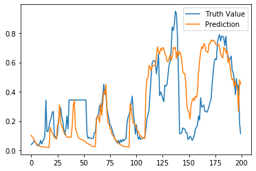
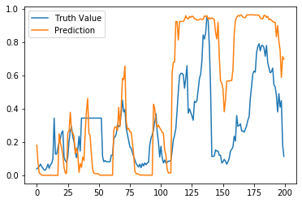

# Air_Pollution_Prediction

It is expected that the most successful model, which makes the most comprehensive assessment for predicting next hour air pollution using the data, is expected.

# Dataset
This data set includes hourly air pollutants data from 12 nationally-controlled air-quality monitoring sites. The air-quality data are from the Beijing Municipal Environmental Monitoring Center. The meteorological data in each air-quality site are matched with the nearest weather station from the China Meteorological Administration. The time period is from March 1st, 2013 to February 28th, 2017. Missing data are denoted as NA.

- Link: https://archive.ics.uci.edu/ml/datasets/Beijing+Multi-Site+Air-Quality+Data
- Explanation:
    1. No: row number
    2. year: year of data in this row
    3. month: month of data in this row
    4. day: day of data in this row
    5. hour: hour of data in this row
    6. pm2.5: PM2.5 concentration (pollution)
    7. DEWP: Dew Point
    8. TEMP: Temperature
    9. PRES: Pressure
    10. cbwd: Combined wind direction
    11. Iws: Cumulated wind speed
    12. Is: Cumulated hours of snow
    13. Ir: Cumulated hours of rain

### Plot of the Pollution Column

 

### Correlation Between Variables

 

# Preprocessings
- Merge ('year', 'month', 'day', 'hour' ) columns as 'DateTime' and convert these columns into a timestamp.
- Remove the unwanted columns
- Calculation Null Values and Filling Them with Mean Values
- Finding and Removing Outliers
- Checking correlations between the independent variables
- Split Dataset into training and test data
- Feature scaling- MinMAxScaler & StandartScaler
- PCA (Principai Component Analysis)

# Machine Learning Model

 

# Deep Learning Model

 

### Best model DL -Bayesion Optimization Results

 

